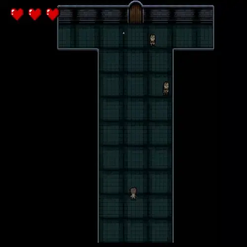

# Apocalypse Escape

This game requires installing the [Greenfoot IDE](https://www.greenfoot.org/door) to run (see [Running the Game](#running-the-game))

## Overview

This repository is an upload of a project created without the intial use of a version control system, therefore the git hitory does not contain the development of the codebase.

Apocalypse Escape has 5 unique levels created using a sprite based mapping system. The player must shoot and elimate all enemies in the current level to open the door to the next room.

After finishing all 5 levels, the player wins the game.

If an enemy hits the player, one heart is lost. If all hearts are lost, the player loses the game.

## Running the Game

This 2D Dungeon crawler game was built using the [Greenfoot IDE](https://www.greenfoot.org/door). The Greenfoot dependency files have been removed for viewing purposes. To run the game, please install [Greenfoot](https://www.greenfoot.org/download) and checkout the `initial commit` hash. Opening the Greenfoot file in the `initial commit` will open the game.
